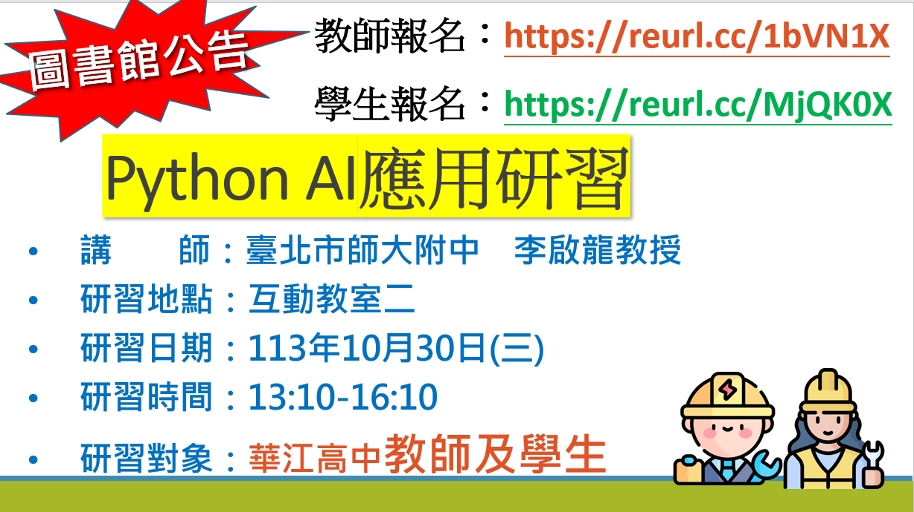

# Python AI 應用研習

# Origin

One day, our homeroom teacher sent this onto our class's communication platform. It's a Python AI course, and it's free.
My friend was like, "Why not?" and dragged me to signed up for it. I've always been interested in AI, and I've always
wanted to learn more about it. So here I am, writing this README.md file.

# What this repo contains
The codes I wrote (copied) during the course.